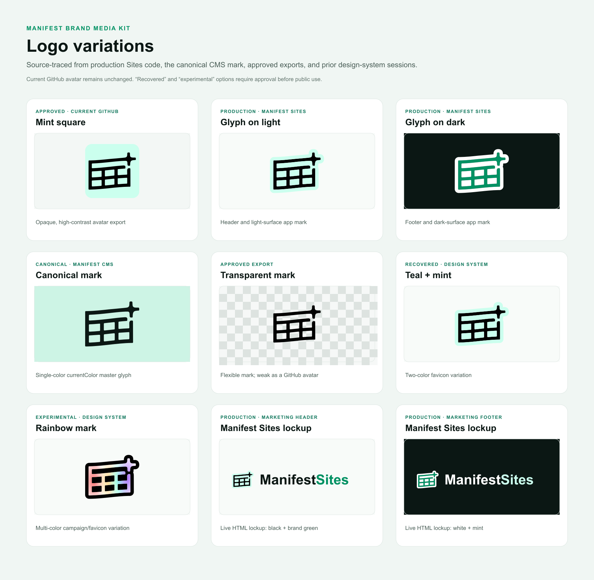

# Manifest logo variations

This is the source-traceable working media kit for Manifest and Manifest Sites branding.

## Classification

| Variation | Standing | Source |
| --- | --- | --- |
| Mint square | Approved; previous GitHub avatar | Approved opaque export supplied during the GitHub branding work |
| Glyph on light | Production | `apps/manifest-sites/public/brand/glyph-on-light.svg` |
| Glyph on dark | Production | `apps/manifest-sites/public/brand/glyph-on-dark.svg` |
| Canonical mark | Canonical | Byte-for-byte source from `apps/client/public/icon.svg`, surfaced by the Sites app as `manifest.svg` |
| Transparent black mark | Approved export | Prior GitHub branding export; retained for flexible placements, not recommended as the avatar |
| Teal + mint favicon | Selected; current GitHub avatar | Prior design-system/session export, selected for the organization identity |
| Rainbow mark | Experimental | Prior design-system/session export; not approved for the core identity |
| Manifest Sites lockups | Production composition | The live marketing/demo shell combines the production glyph with an HTML `Manifest Sites` word treatment |

The previous design-system session also listed standalone `wordmark.svg`, `wordmark-sites.svg`, and `lockup.svg` artifacts. Their actual vector bytes were not present in the retained transcript or local worktrees, so they are documented as historical evidence but deliberately not reconstructed or approximated here.

## Rebuild

Run `pnpm build:kit`. The board is generated from the exact SVG sources in `brand-kit/sources/` and the production Sites lockup treatment.
