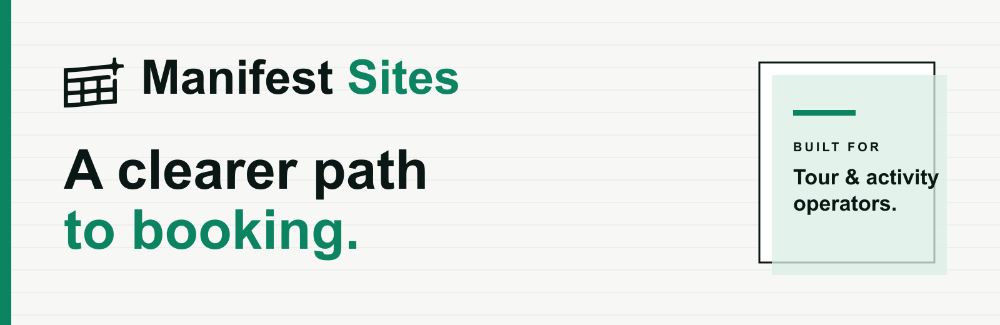

  

  <strong>Modern, mobile-ready websites for tour and activity operators.</strong>

  <a href="https://manifest.site">Website</a>
  &nbsp;·&nbsp;
  <a href="https://github.com/orgs/manifest-site/discussions">Discussions</a>
  &nbsp;·&nbsp;
  <a href="https://manifest.site/coming-soon/">Launch updates</a>

---

## A clearer path to booking

Manifest Sites turns the website an operator already has into a modern experience that is easier for guests to explore and book. We combine structured content migration, a flexible design system, and an operator-focused delivery workflow to move from an existing site to a launch-ready rebuild.

### What we care about

- **Built for bookings** — clear journeys, strong calls to action, and dependable booking handoffs.
- **True to the operator** — the original brand, content, and media remain the source material.
- **Ready for real guests** — responsive layouts, accessible interactions, and production-minded performance.
- **Designed to evolve** — structured content and reusable components make future updates practical.

### What lives here

This organization hosts the delivery infrastructure and generated sites behind Manifest Sites. Customer work remains private by default; public resources and community material will appear here as they are ready.
